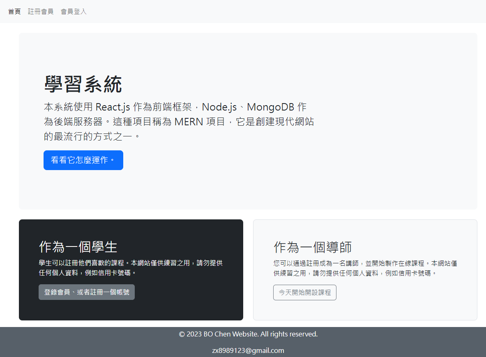
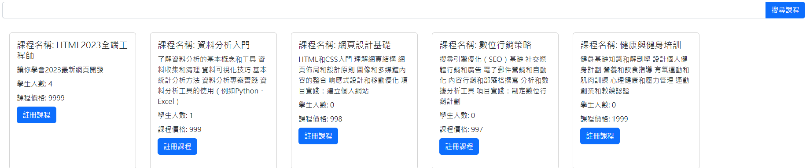
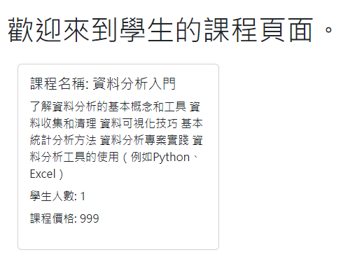
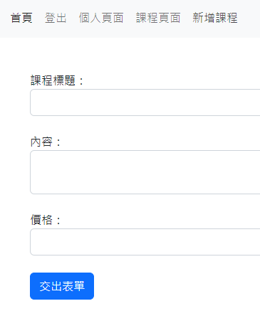
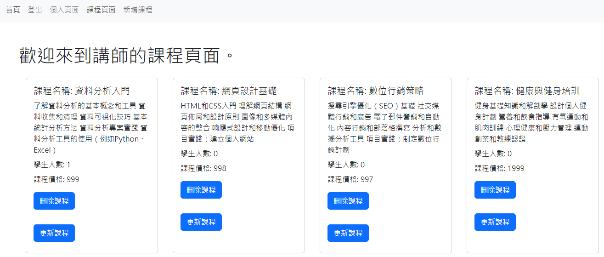
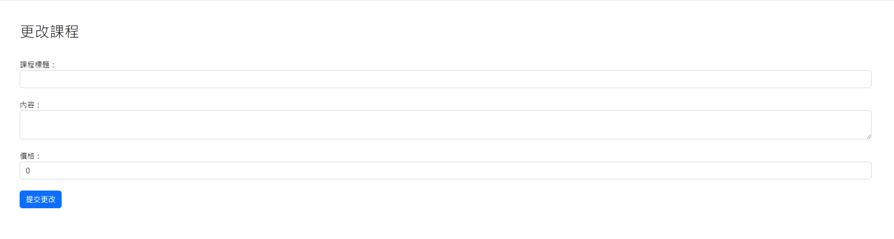

# 線上課程管理網站


* 本系統使用 React.js 作為前端框架，Node.js、MongoDB 作為後端服務器

## 畫面



* [線上觀看連結](https://project-9-frontend.onrender.com/)
  
## 功能

測試帳號密碼

```bash
身分:學生
帳號:student@gmail.com
密碼： 123456
```
```bash
身分:講師
帳號:instructor@gmail.com
密碼： 123456
```
- [x] 登入
- 講師帳號:會顯示個人頁面、課程頁面、新增課程。
- 學生帳號:會顯示個人頁面、課程頁面、註冊課程。
- [x] 登出
- [x] 新增課程
- 課程標題
     - 輸入你想教的課程
- 內容
     - 輸入你的課程描述
-價格
- [x] 註冊課程
- 可以收尋你有興趣的課程，也會顯示所有課程。
- [x] 課程頁面
- 會顯示你新增課程或註冊課程的資料，包括學生人數。
...

## 畫面

- 學生註冊課程



- 學生課程頁面



-講師新增課程



- 講師課程新增課程後頁面



- 講師更改課程頁面


  
## 安裝

以下將會引導你如何安裝此專案到你的電腦上。

Node.js 版本建議為：`16.15.0` 以上...

### 取得專案

```bash
https://github.com/tsai12123/project_9
```
### 安裝套件

```bash
npm install
```

### 環境變數設定

請在終端機輸入 `cp .env.example .env` 來複製 .env.example 檔案，並依據 `.env` 內容調整相關欄位。

### 運行專案

```bash
cd client
```
```bash
npm start
```
```bash
cd server
```
```bash
nodemon server.js
```

### 開啟專案

在瀏覽器網址列輸入以下即可看到畫面

```bash
http://localhost:8080/
```

## 專案技術

- Node.js v20.7.0
- bcrypt v5.1.0
- cors v2.8.5
- Axios v1.1.3
- Bootstrap v5.1.3
- express v4.18.2
- joi v17.6.3
- mongoose v6.6.6
- mongodb v4.9.1
<details>

<summary>jsonwebtoken v8.5.1</summary>

1. 用戶登錄成功後，伺服器生成一個 JWT，其中包含有關用戶的信息。
2. 伺服器將 JWT 返回給客戶端，通常存儲在客戶端的 Cookie 或本地存儲中。
3. 客戶端在後續的請求中將 JWT 包含在請求標頭中。
4. 伺服器接收到請求後，驗證 JWT 的簽名，確保它是有效且未被修改。
5. 如果 JWT 驗證成功，伺服器使用其中的信息來授權用戶並執行請求。

</details>


## 與我聯絡
- [郵件](mailto:zx8989123@gmail.com)
