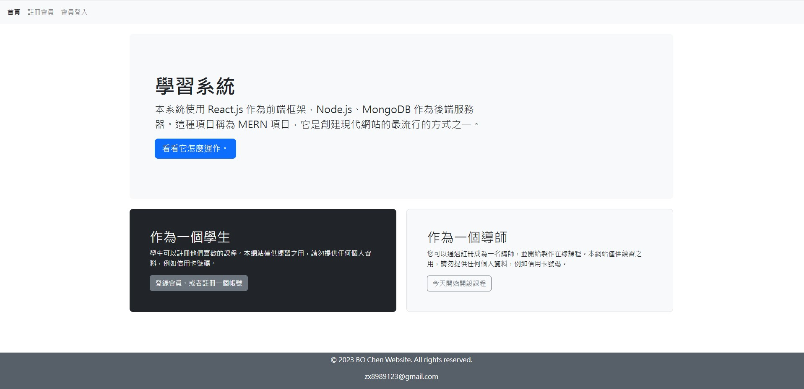
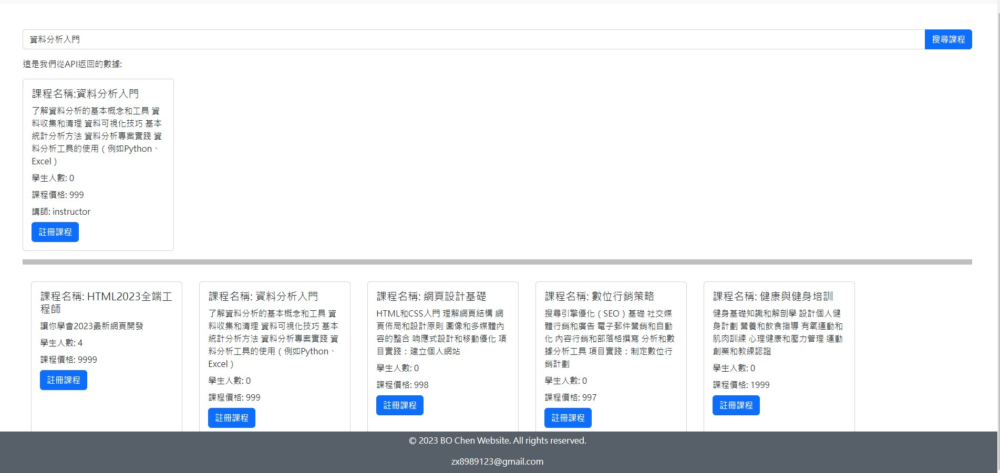
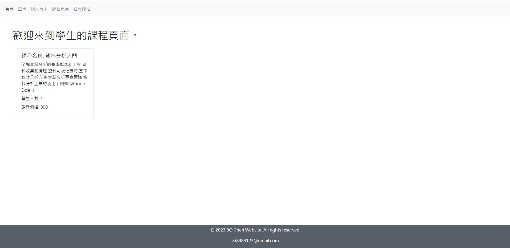
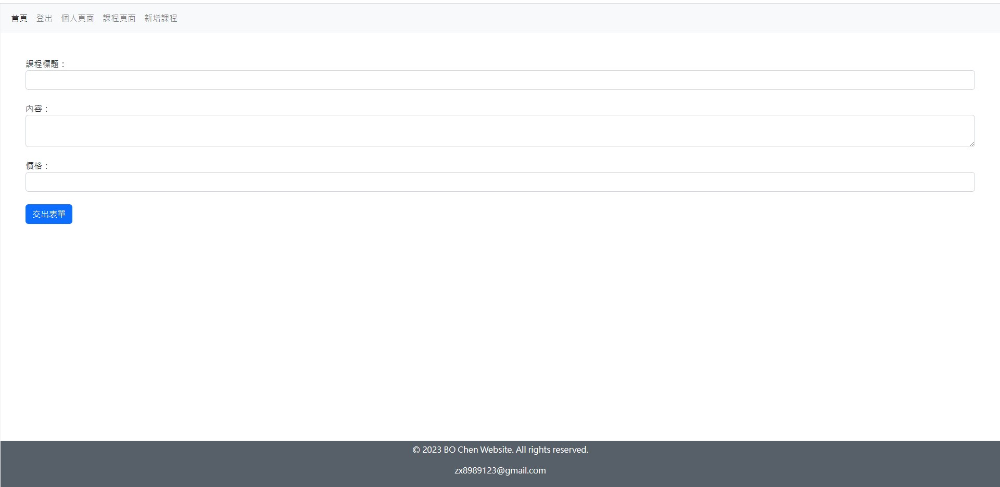
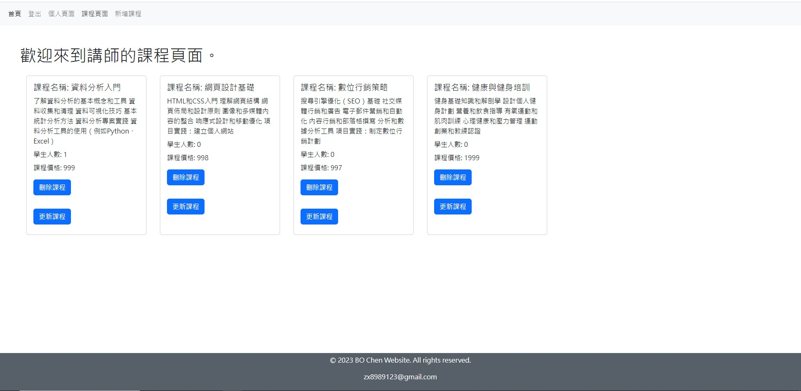
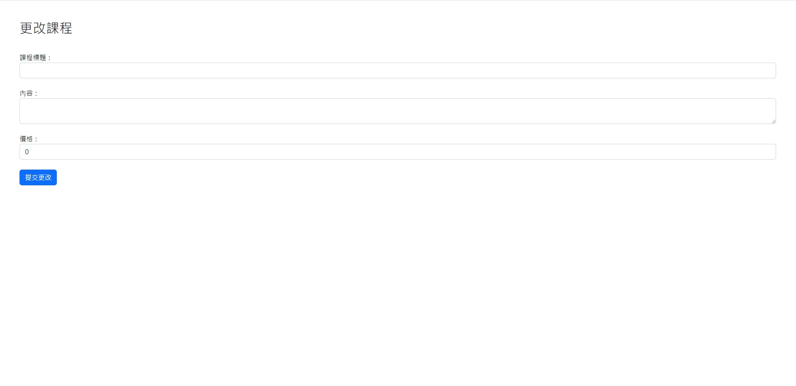

# 線上課程管理網站


* 本系統使用 React.js 作為前端框架，Node.js、MongoDB 作為後端服務器

## 畫面



* [線上觀看連結](https://project-9-frontend.onrender.com/)
  
## 功能

測試帳號密碼

```bash
身分:學生
帳號:student@gmail.com
密碼： 123456
```
```bash
身分:講師
帳號:instructor@gmail.com
密碼： 123456
```
- [x] 登入
- 講師帳號:會顯示個人頁面、課程頁面、新增課程。
- 學生帳號:會顯示個人頁面、課程頁面、註冊課程。
- [x] 登出
- [x] 新增課程
- 課程標題
     - 輸入你想教的課程
- 內容
     - 輸入你的課程描述
-價格
- [x] 註冊課程
- 可以收尋你有興趣的課程，也會顯示所有課程。
- [x] 課程頁面
- 會顯示你新增課程或註冊課程的資料，包括學生人數。
...

## 畫面

- 學生註冊課程



- 學生課程頁面



-講師新增課程



- 講師課程新增課程後頁面



- 講師更改課程頁面


  
## 安裝

以下將會引導你如何安裝此專案到你的電腦上。

Node.js 版本建議為：`16.15.0` 以上...

### 取得專案
